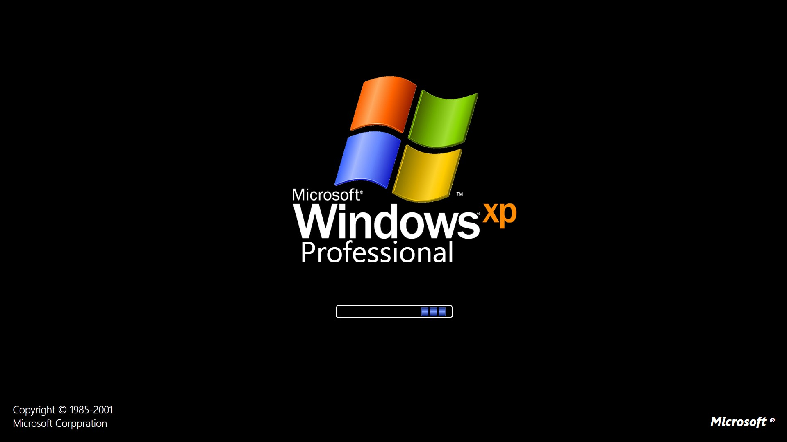
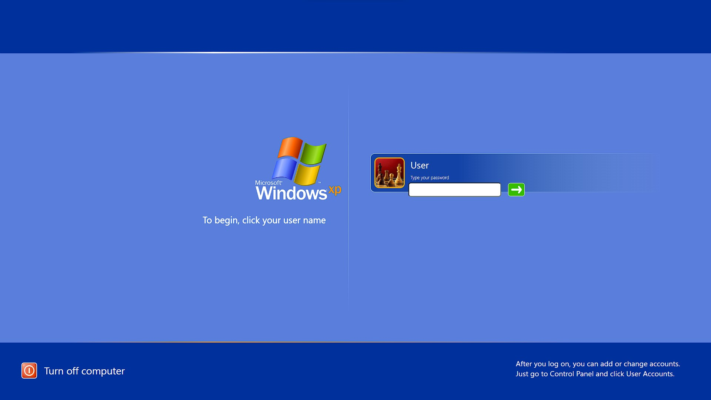
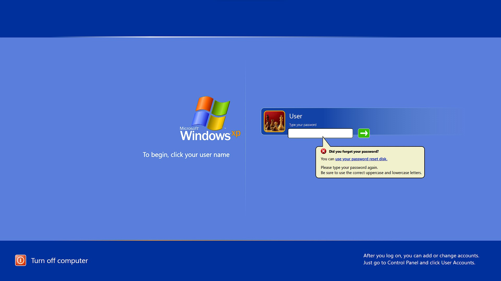
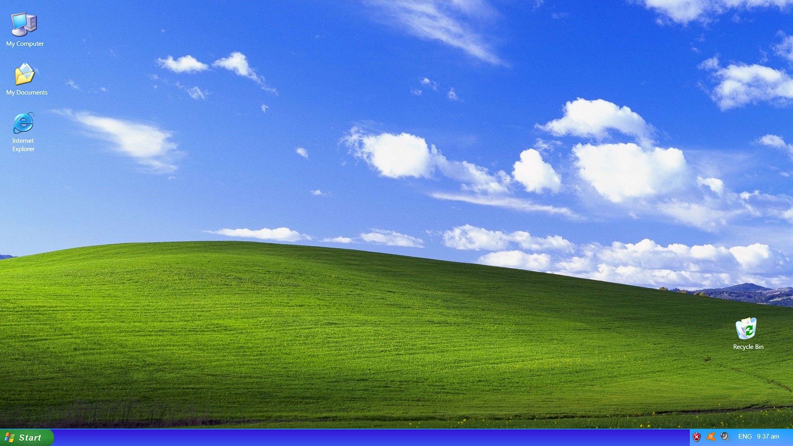
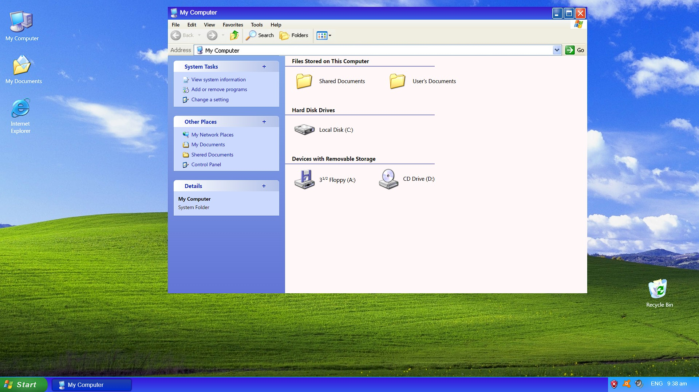
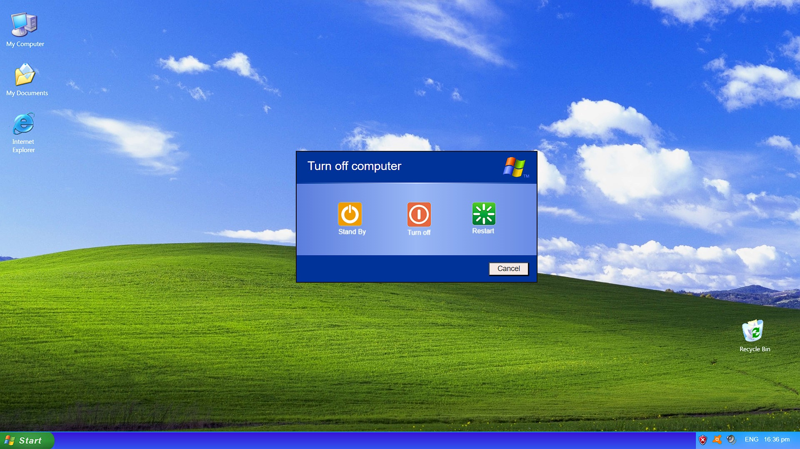

b# WindowsXp-Interface
* !!! FIRST PUT THE FULLSCREEN and Open bootscreen.html!!!
* Using lang - Html, CSS, JavaScript
* WindowsXp interface with Some actions.\
** Login password is "0" or "password".\
** Two ways for open my computer - Using Desktop Icon or My computer icon in Start menu.\
** My Computer Window minimize, close actions.\
** Open the start memu. \
** Restart action.  (<b> Start -> Turn off computer -> Restart </b>)

