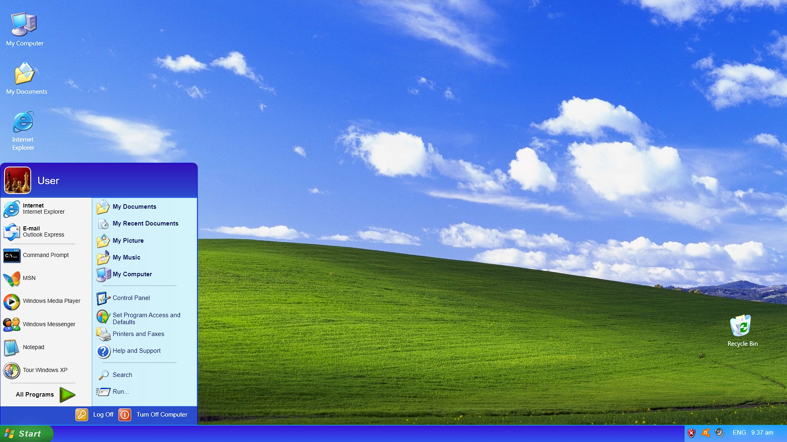

<h1># WindowsXp-Interface</h1>
<h2>!!! FIRST PUT THE FULLSCREEN and Open bootscreen.html !!!   </h2>

<ul>
  <li>Using lang - Html, CSS, JavaScript.   </li>
  <li>WindowsXp interface with Some actions.   </li>
  <ul>
    <li>Login password is "0" or "password".   </li>
    <li>Two ways for open my computer - Using Desktop Icon or My computer icon in Start menu.   </li>
    <li>My Computer Window minimize, close actions.   </li>
    <li>Open the start memu.   </li>
    <li>Restart action.  (<b> Start -> Turn off computer -> Restart </b>)   </li>
  </ul>
</ul>

